<!-- LAST EDITED: 2026-02-13 -->

# Terraform Workflows - Architecture

## Workflow Overview

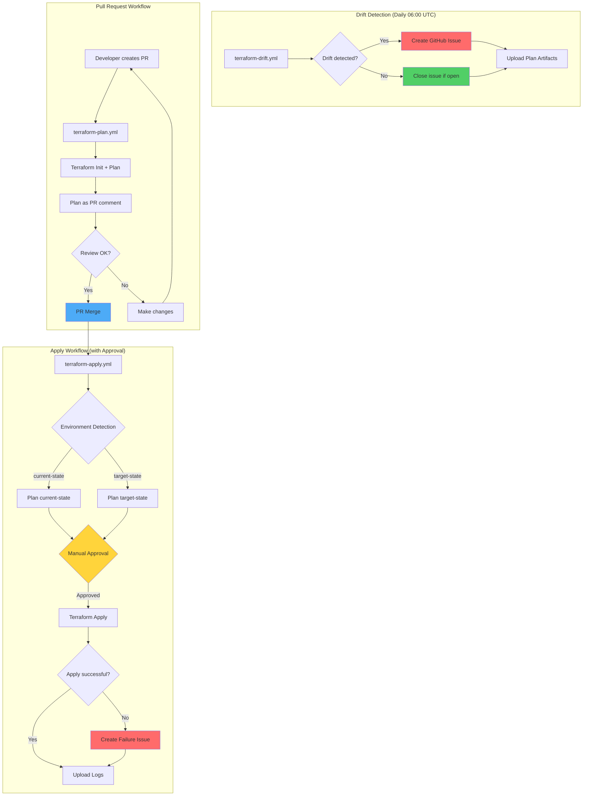

## Workflow Details

### 1. Drift Detection Workflow

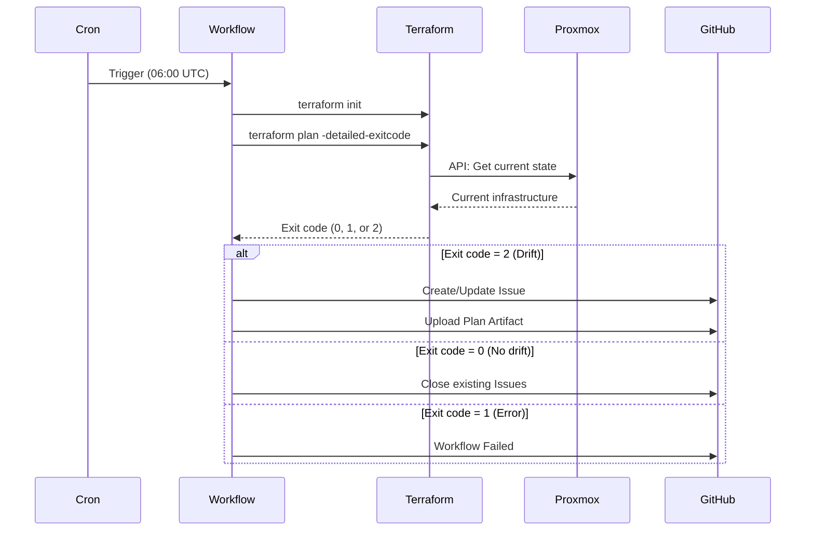

### 2. Pull Request Workflow

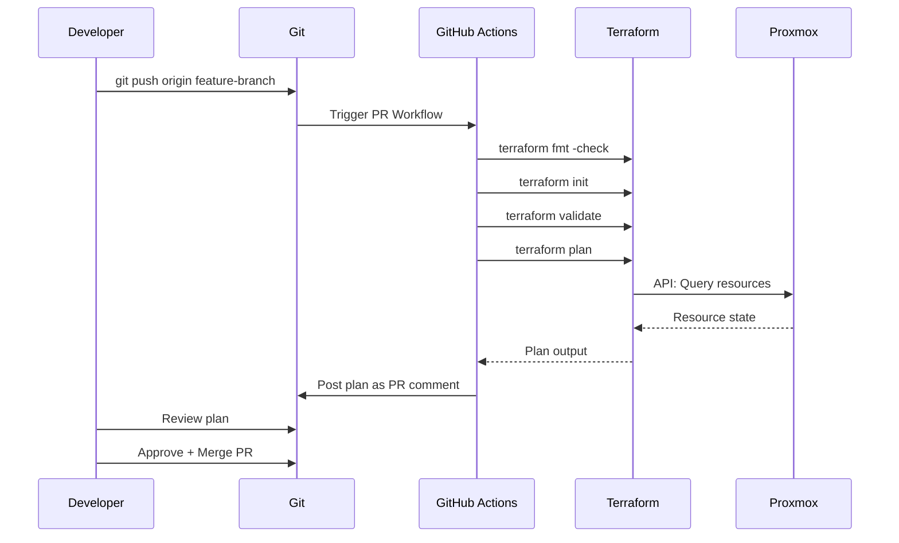

### 3. Apply Workflow

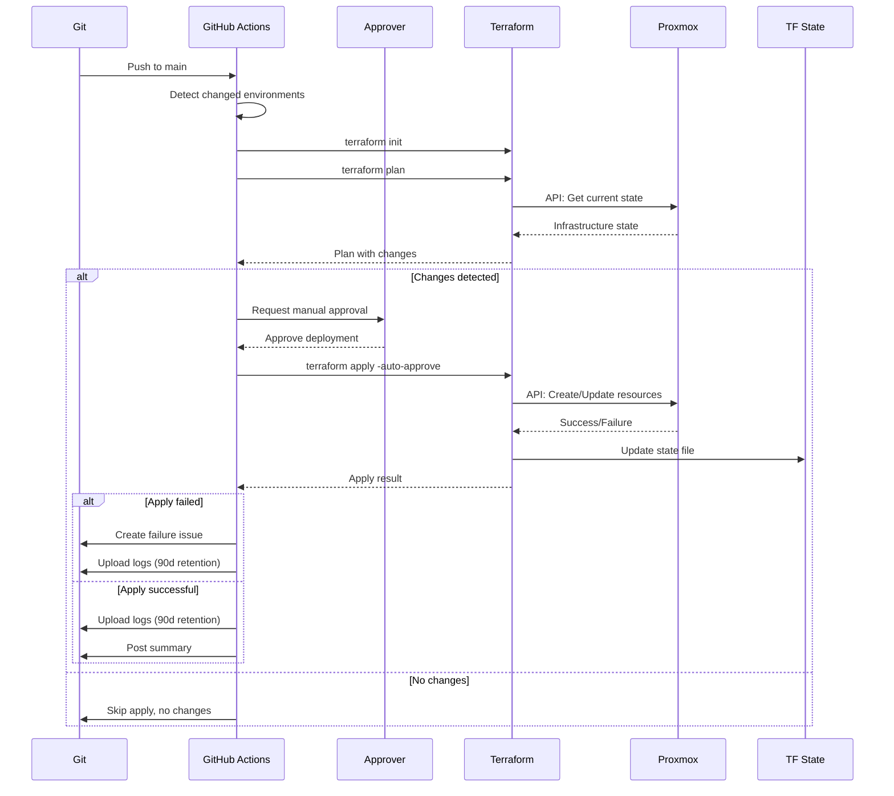

## Concurrency Control

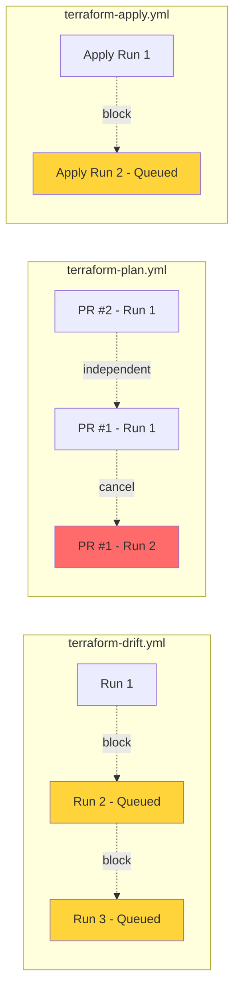

### Concurrency Groups

| Workflow | Group | Strategy | Reason |
|----------|-------|----------|--------|
| `terraform-drift.yml` | `terraform-drift` | Queue | Prevents state locks |
| `terraform-plan.yml` | `terraform-plan-${{ pr }}` | Cancel in progress | Saves resources on quick updates |
| `terraform-apply.yml` | `terraform-apply` | Queue | Critical - no race conditions |

## Shared Setup (Composite Action)

All Terraform jobs use the shared Composite Action `.github/actions/terraform-setup/` which handles:

1. **Import Secrets from Vault** — `hashicorp/vault-action@v3` (environment-specific secrets passed as input)
2. **Configure AWS Credentials** — `aws-actions/configure-aws-credentials@v4` (OIDC federation)
3. **Setup Terraform** — `hashicorp/setup-terraform@v3` (version centralized in action default)
4. **Terraform fmt** — optional (`run-fmt` input, default: `true`)
5. **Terraform init** — always runs
6. **Terraform validate** — optional (`run-validate` input, default: `true`)

**Note:** `actions/checkout@v4` must run **before** the composite action call (GitHub needs the
repo checked out to find local actions).

Apply workflows set `run-fmt: 'false'`, `run-validate: 'false'`, and `terraform-wrapper: 'false'`.

## Security Model

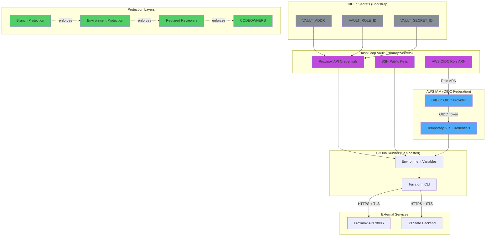

## Issue Management

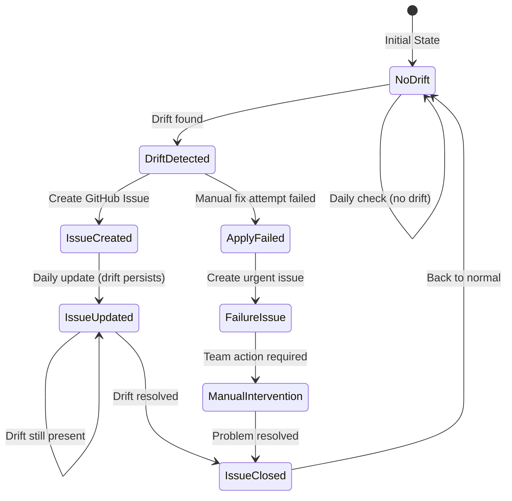

### Issue Labels

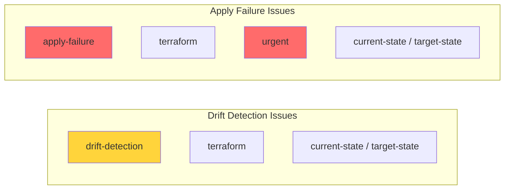

## Environment Flow

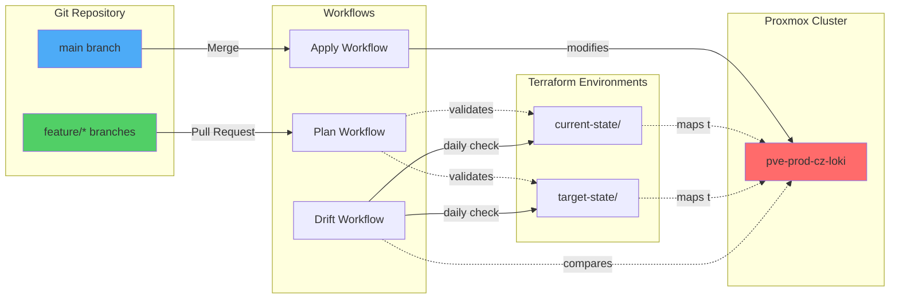

## Artifact Retention

```mermaid
gantt
    title Artifact Lifecycle
    dateFormat X
    axisFormat %d days

    section Drift Detection
    Plan Artifacts (30d) :30, 30

    section PR Plans
    Plan Artifacts (30d) :30, 30

    section Apply Logs
    Apply Logs (90d) :90, 90
    Plan Outputs (90d) :90, 90
```

## Best Practices Implementation

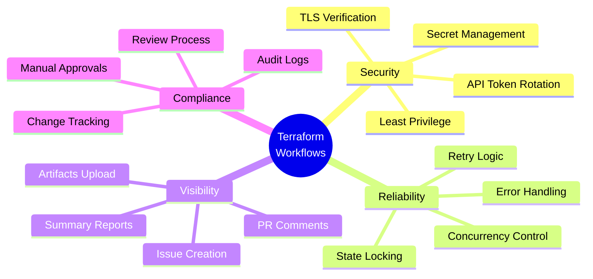

## Workflow Triggers Matrix

| Event | Drift | Plan | Apply |
|-------|-------|------|-------|
| Schedule (Cron) | ✅ 06:00 UTC | ❌ | ❌ |
| Push to main | ⚠️ Optional | ❌ | ✅ |
| Pull Request | ❌ | ✅ | ❌ |
| workflow_dispatch | ✅ | ❌ | ✅ |

## Permissions Model

```yaml
# terraform-drift.yml
permissions:
  contents: read      # Checkout code
  issues: write       # Create/update drift issues
  id-token: write     # AWS OIDC federation

# terraform-plan.yml
permissions:
  contents: read      # Checkout code
  pull-requests: write # Post plan comments
  issues: write       # Create issues on errors
  id-token: write     # AWS OIDC federation

# terraform-apply.yml
permissions:
  contents: read      # Checkout code
  issues: write       # Create failure issues
  id-token: write     # AWS OIDC federation
```

## Error Handling Strategy

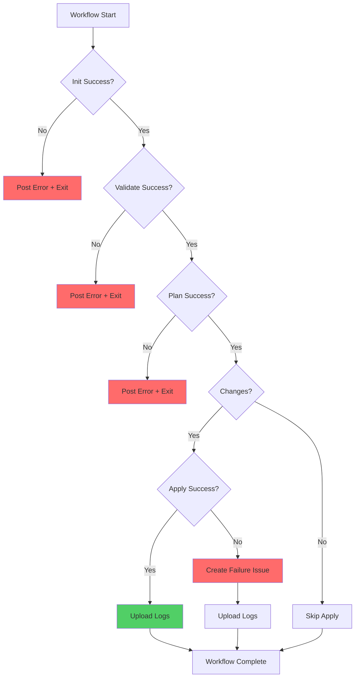

## Resources

- [Terraform CLI Docs](https://www.terraform.io/cli)
- [bpg/proxmox Provider](https://registry.terraform.io/providers/bpg/proxmox/latest/docs)
- [GitHub Actions Contexts](https://docs.github.com/en/actions/learn-github-actions/contexts)
- [Workflow Syntax](https://docs.github.com/en/actions/using-workflows/workflow-syntax-for-github-actions)
