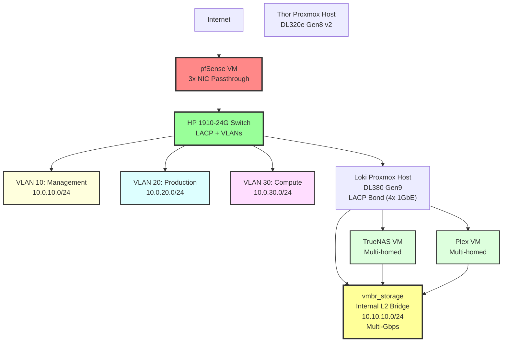

# Server Infrastructure - Multi-Location IaC

[](https://www.terraform.io/)
[](https://www.ansible.com/)
[](https://www.proxmox.com/)
[](https://github.com/features/actions)

> **Production-grade Infrastructure-as-Code** für Multi-Location Server-Infrastruktur mit Proxmox, pfSense, TrueNAS und vollautomatisierter CI/CD Pipeline.

---

## 🎯 Portfolio Highlights

Dieses Repository demonstriert **Enterprise-Level DevOps Skills** durch:

- ✅ **Multi-Environment Management** (IST/SOLL Terraform Workspaces)
- ✅ **Advanced Networking** (VLANs, LACP Bonding, Multi-homed VMs)
- ✅ **Full CI/CD Automation** (Terraform Plan on PR, Apply on Merge)
- ✅ **Configuration Management** (Ansible Dynamic Inventory from Terraform)
- ✅ **Monitoring-as-Code** (Prometheus/Grafana Dashboards)
- ✅ **Security Best Practices** (Secret Management, tfsec/Checkov Scanning)
- ✅ **Production Testing** (Live API Integration mit Proxmox/pfSense)

---

## 🏗️ Architektur-Übersicht

### Physische Infrastruktur

**Colo Colocation Datacenter:**
- **Thor** (HP DL320e Gen8 v2): Proxmox Host + pfSense VM
- **Loki** (HP DL380 Gen9): Proxmox Compute (7 VMs + 13 LXCs)
- **HP 1910-24G Switch**: LACP-fähig, VLANs 10/20/30

**Externe Services:**
- **Netcup VPS**: Mailcow (Mail-Hosting)
- **Hetzner**: VPS + Storage Box (Backups)

### Netzwerk-Architektur (Target State)



---

## 📁 Repository-Struktur

```
server-infrastructure/
├── terraform/
│   ├── environments/
│   │   ├── current-state/      # IST-Zustand (Dell Switch, Flat Network)
│   │   └── target-state/       # SOLL-Zustand (HP Switch, VLANs)
│   └── modules/
│       ├── proxmox-vm/         # Reusable VM Module (Multi-NIC, VLAN-Support)
│       ├── proxmox-lxc/        # Reusable LXC Module
│       └── network-bridge/     # Network Abstraktion
│
├── ansible/
│   ├── playbooks/              # Configuration Management
│   ├── roles/                  # Proxmox, pfSense, TrueNAS, Monitoring
│   └── inventory/scripts/      # Dynamic Inventory (Terraform Outputs)
│
├── monitoring/
│   ├── prometheus/             # Metrics, Alerts, Recording Rules
│   └── grafana/                # Dashboards (Infrastructure, Network, Storage)
│
├── .github/workflows/
│   ├── terraform-plan.yml      # PR: Plan only
│   ├── terraform-apply.yml     # Merge: Apply mit Manual Approval
│   └── security-scan.yml       # tfsec, Checkov
│
└── docs/architecture/          # Detaillierte Architektur-Dokumentation
```

---

## 🚀 Quick Start

### Voraussetzungen

- **Terraform** >= 1.7.0
- **Ansible** >= 2.16
- **Proxmox API Token** (siehe [docs/setup/proxmox-api.md](docs/setup/proxmox-api.md))
- **Terraform Cloud Account** (Free Tier)

### 1. Terraform Workspace Setup

```bash
# Terraform Cloud konfigurieren
terraform login

# Target State Workspace initialisieren
cd terraform/environments/target-state
terraform init
terraform plan
```

### 2. Ansible Dynamic Inventory

```bash
# Terraform Outputs → Ansible Inventory
cd ansible
./inventory/scripts/terraform_inventory.py --list

# Test Playbook
ansible-playbook -i inventory/scripts/terraform_inventory.py playbooks/site.yml --check
```

### 3. Monitoring Stack Deploy

```bash
ansible-playbook playbooks/monitoring_stack.yml
```

---

## 🔄 CI/CD Workflow

### Pull Request Workflow

1. **Branch erstellen**: `git checkout -b feature/add-vm`
2. **Terraform ändern**: VM/LXC in `terraform/environments/target-state/`
3. **Commit & Push**: GitHub Actions läuft automatisch
4. **Terraform Plan**: Wird als PR Comment gepostet
5. **Review & Merge**: Manual Approval nötig
6. **Terraform Apply**: Automatisch nach Merge

### Security Scanning

- **tfsec**: Terraform Security Checks
- **Checkov**: Policy-as-Code Validation
- **Pre-commit Hooks**: terraform fmt, validate, tflint

---

## 📊 Monitoring

### Prometheus Metrics

- **LACP Bond Health**: `node_bonding_slaves{bond="bond0"}`
- **VLAN Routing**: `up{job="pfsense"}`
- **ZFS Pool Usage**: `zfs_pool_used_bytes / zfs_pool_size_bytes`

### Grafana Dashboards

- **Infrastructure Overview**: LACP Throughput, VLAN Health
- **Network Performance**: Per-VLAN Bandwidth, Routing Latency
- **Storage Health**: ZFS Pools, Disk Failures

---

## 🛠️ Technologie-Stack

| Kategorie | Technologie | Zweck |
|-----------|-------------|-------|
| **IaC** | Terraform (telmate/proxmox) | VM/LXC Provisioning |
| **Config Management** | Ansible | Server-Konfiguration, API Calls |
| **Virtualisierung** | Proxmox VE 8.4 | Hypervisor (KVM + LXC) |
| **Networking** | pfSense 2.8, HP 1910-24G | Firewall, VLAN Routing, LACP |
| **Storage** | TrueNAS, ZFS | NFS/SMB Shares, Datasets |
| **Monitoring** | Prometheus, Grafana, Alertmanager | Metrics, Dashboards, Alerts |
| **CI/CD** | GitHub Actions | Automated Testing, Deployment |
| **State Backend** | Terraform Cloud | Remote State, Locking |

---

## 📚 Dokumentation

- **[Architecture Documentation](docs/architecture/)**: IST/SOLL Zustände, Migration Plan
- **[Terraform Modules](terraform/modules/)**: Reusable Components (terraform-docs)
- **[Ansible Roles](ansible/roles/)**: Configuration Management Details
- **[Runbooks](docs/runbooks/)**: Operational Procedures, Disaster Recovery

---

## 🎓 Learning Outcomes (Portfolio-Kontext)

Dieses Projekt zeigt praktische Erfahrung in:

- **Infrastructure-as-Code**: Terraform Modules, Multi-Environment State Management
- **Network Engineering**: VLANs, LACP Bonding, Multi-homed VMs
- **Automation**: Ansible Dynamic Inventory, API Integration
- **CI/CD**: GitHub Actions, Pre-commit Hooks, Security Scanning
- **Observability**: Prometheus Metrics, Grafana Dashboards, Alert Rules
- **Documentation**: ADRs, Runbooks, Architecture Diagrams

---

## 📝 Lizenz

Dieses Repository ist ein **Portfolio-Projekt** und dient zu Demonstrationszwecken.

---

## 📧 Kontakt

**DevOps Portfolio Projekt** von Adrik
GitHub: [@adrik](https://github.com/adrik) | [LinkedIn](https://linkedin.com/in/adrik)
