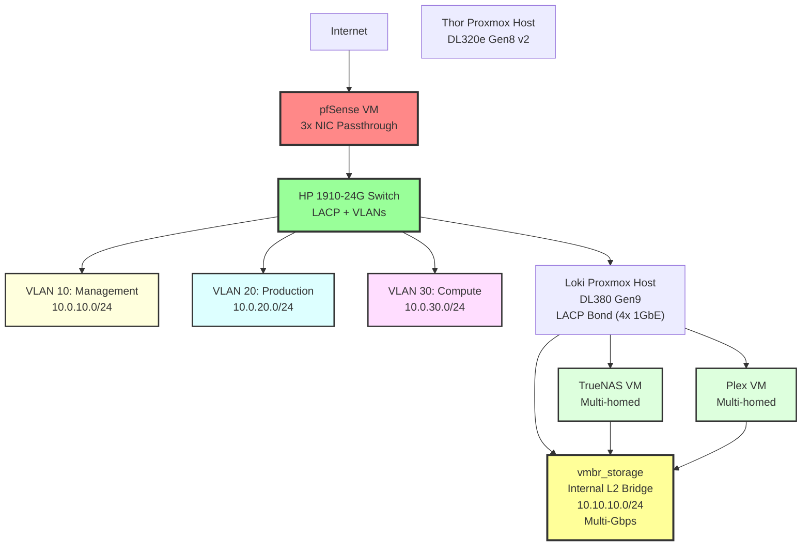

# Server Infrastructure - Multi-Location IaC

[](https://www.terraform.io/)
[](https://www.ansible.com/)
[](https://www.proxmox.com/)
[](https://github.com/features/actions)

> **Production-grade Infrastructure-as-Code** for multi-location server infrastructure with Proxmox, pfSense, TrueNAS
> and fully automated CI/CD pipeline.

---

## Portfolio Highlights

This repository demonstrates **Enterprise-Level DevOps Skills** through:

- **Multi-Environment Management** (Current/Target Terraform Workspaces)
- **Advanced Networking** (VLANs, LACP Bonding, Multi-homed VMs)
- **Full CI/CD Automation** (Terraform Plan on PR, Apply on Merge)
- **Configuration Management** (Ansible Dynamic Inventory from Terraform)
- **Monitoring-as-Code** (Prometheus/Grafana Dashboards)
- **Security Best Practices** (HashiCorp Vault, tfsec/Checkov Scanning)
- **Production Testing** (Live API Integration with Proxmox/pfSense)

---

## Architecture Overview

### Physical Infrastructure

**Colocation Datacenter:**

- **Thor** (HP DL320e Gen8 v2): Proxmox Host + pfSense VM
- **Loki** (HP DL380 Gen9): Proxmox Compute (5 VMs + 13 LXCs)
- **HP 1910-24G Switch**: LACP-capable, VLANs 10/20/30

**External Services:**

- **Netcup VPS**: Mailcow (Email Hosting)
- **Hetzner**: VPS + Storage Box (Backups)

### Network Architecture (Target State)



---

## Repository Structure

```text
server-infrastructure/
├── terraform/
│   ├── environments/
│   │   ├── current-state/      # Current state (Dell Switch, Flat Network)
│   │   └── target-state/       # Target state (HP Switch, VLANs)
│   └── modules/
│       ├── proxmox-vm/         # Reusable VM Module (Multi-NIC, VLAN Support)
│       ├── proxmox-lxc/        # Reusable LXC Module
│       └── network-bridge/     # Network Abstraction
├── ansible/
│   ├── playbooks/              # Configuration Management
│   ├── roles/                  # Proxmox, pfSense, TrueNAS, Monitoring
│   └── inventory/scripts/      # Dynamic Inventory (Terraform Outputs)
├── monitoring/
│   ├── prometheus/             # Metrics, Alerts, Recording Rules
│   └── grafana/                # Dashboards (Infrastructure, Network, Storage)
├── .github/workflows/
│   ├── terraform-plan.yml      # PR: Plan only
│   ├── terraform-apply.yml     # Merge: Apply with Manual Approval
│   └── terraform-drift.yml     # Daily drift detection
└── docs/architecture/          # Detailed Architecture Documentation
```

---

## Quick Start

### Prerequisites

- **Terraform** >= 1.14.3
- **Ansible** >= 2.16
- **Proxmox API Token** (see [docs/setup/proxmox-api.md](docs/setup/proxmox-api.md))
- **Terraform Cloud Account** (Free Tier)
- **HashiCorp Vault** (for secrets management)

### 1. Terraform Workspace Setup

```bash
# Configure Terraform Cloud
terraform login

# Initialize Target State Workspace
cd terraform/environments/target-state
terraform init
terraform plan
```

### 2. Ansible Dynamic Inventory

```bash
# Terraform Outputs → Ansible Inventory
cd ansible
./inventory/scripts/terraform_inventory.py --list

# Test Playbook
ansible-playbook -i inventory/scripts/terraform_inventory.py playbooks/site.yml --check
```

### 3. Monitoring Stack Deployment

```bash
ansible-playbook playbooks/monitoring_stack.yml
```

---

## Development Setup

### Pre-commit Hooks

This repository uses Pre-commit Hooks for automated code quality checks:

```bash
# Install Pre-commit
pip install pre-commit

# Enable Hooks
pre-commit install

# Run Manually
pre-commit run --all-files
```

**Active Hooks:**

- `terraform fmt` - Automatic Formatting
- `terraform validate` - Syntax Validation
- `tflint` - Terraform Best Practices Linting
- `terraform-docs` - Auto-generated README Updates
- `markdownlint` - Markdown Formatting
- `gitleaks` - Secret Detection
- Line-ending Normalization (CRLF → LF)

### GitHub Actions Workflows

**Automated Drift Detection** (`.github/workflows/terraform-drift.yml`):

- **Schedule**: Daily at 06:00 UTC
- **Check**: `terraform plan` against Proxmox API
- **Alert**: GitHub Issue on drift detection
- **Environments**: current-state, target-state

**Pull Request Validation** (`.github/workflows/terraform-plan.yml`):

- **Trigger**: PR to `main`
- **Checks**: fmt, validate, plan
- **Output**: Plan as PR Comment

**Automated Apply** (`.github/workflows/terraform-apply.yml`):

- **Trigger**: Merge to `main`
- **Approval**: Manual Review required
- **Deployment**: Terraform apply with State-Locking

**Secrets Management:**
All infrastructure secrets are managed through **HashiCorp Vault**. Only Vault access credentials are stored in GitHub Secrets:

- `VAULT_ADDR` - Vault server URL
- `VAULT_ROLE_ID` - AppRole authentication
- `VAULT_SECRET_ID` - AppRole secret

**Self-hosted Runner:**

- **LXC Container** `github-runner-prod-cz-01` (VMID 6200)
- **Network Access**: Direct access to Proxmox API (10.0.1.0/24)
- **Setup**: Ansible Playbook `ansible/playbooks/github_runner_setup.yml`
- **Purpose**: GitHub-hosted runners cannot reach private Proxmox network

See [.github/workflows/README.md](.github/workflows/README.md) for details.

---

## CI/CD Workflow

### Pull Request Workflow

1. **Create Branch**: `git checkout -b feature/add-vm`
2. **Modify Terraform**: Add VM/LXC in `terraform/environments/target-state/`
3. **Commit & Push**: GitHub Actions runs automatically
4. **Terraform Plan**: Posted as PR comment
5. **Review & Merge**: Manual approval required
6. **Terraform Apply**: Automatically triggered after merge

### Security Scanning

- **tfsec**: Terraform Security Checks
- **Checkov**: Policy-as-Code Validation
- **Pre-commit Hooks**: terraform fmt, validate, tflint
- **Vault Integration**: Centralized secrets management

---

## Monitoring

### Prometheus Metrics

- **LACP Bond Health**: `node_bonding_slaves{bond="bond0"}`
- **VLAN Routing**: `up{job="pfsense"}`
- **ZFS Pool Usage**: `zfs_pool_used_bytes / zfs_pool_size_bytes`

### Grafana Dashboards

- **Infrastructure Overview**: LACP Throughput, VLAN Health
- **Network Performance**: Per-VLAN Bandwidth, Routing Latency
- **Storage Health**: ZFS Pools, Disk Failures

---

## Technology Stack

| Category               | Technology                        | Purpose                         |
| ---------------------- | --------------------------------- | ------------------------------- |
| **IaC**                | Terraform (bpg/proxmox)           | VM/LXC Provisioning             |
| **Config Management**  | Ansible                           | Server Configuration, API Calls |
| **Virtualization**     | Proxmox VE 8.4                    | Hypervisor (KVM + LXC)          |
| **Networking**         | pfSense 2.8, HP 1910-24G          | Firewall, VLAN Routing, LACP    |
| **Storage**            | TrueNAS, ZFS                      | NFS/SMB Shares, Datasets        |
| **Secrets Management** | HashiCorp Vault                   | Centralized Secret Storage      |
| **Monitoring**         | Prometheus, Grafana, Alertmanager | Metrics, Dashboards, Alerts     |
| **CI/CD**              | GitHub Actions                    | Automated Testing, Deployment   |
| **State Backend**      | Terraform Cloud                   | Remote State, Locking           |

---

## Documentation

- **[Architecture Documentation](docs/architecture/)**: Current/Target States, Migration Plan
- **[Terraform Modules](terraform/modules/)**: Reusable Components (terraform-docs)
- **[Ansible Roles](ansible/roles/)**: Configuration Management Details
- **[Runbooks](docs/runbooks/)**: Operational Procedures, Disaster Recovery

---

## Learning Outcomes (Portfolio Context)

This project demonstrates practical experience in:

- **Infrastructure-as-Code**: Terraform Modules, Multi-Environment State Management
- **Network Engineering**: VLANs, LACP Bonding, Multi-homed VMs
- **Automation**: Ansible Dynamic Inventory, API Integration
- **CI/CD**: GitHub Actions, Pre-commit Hooks, Security Scanning
- **Secrets Management**: HashiCorp Vault Integration, AppRole Authentication
- **Observability**: Prometheus Metrics, Grafana Dashboards, Alert Rules
- **Documentation**: ADRs, Runbooks, Architecture Diagrams

---

## License

This repository is a **portfolio project** for demonstration purposes.

---

## Contact

**DevOps Portfolio Project** by Adrian Konopczynski
GitHub: [@dranelixx](https://github.com/dranelixx) | [LinkedIn](https://www.linkedin.com/in/adrian-konopczynski-5432b5166/)
