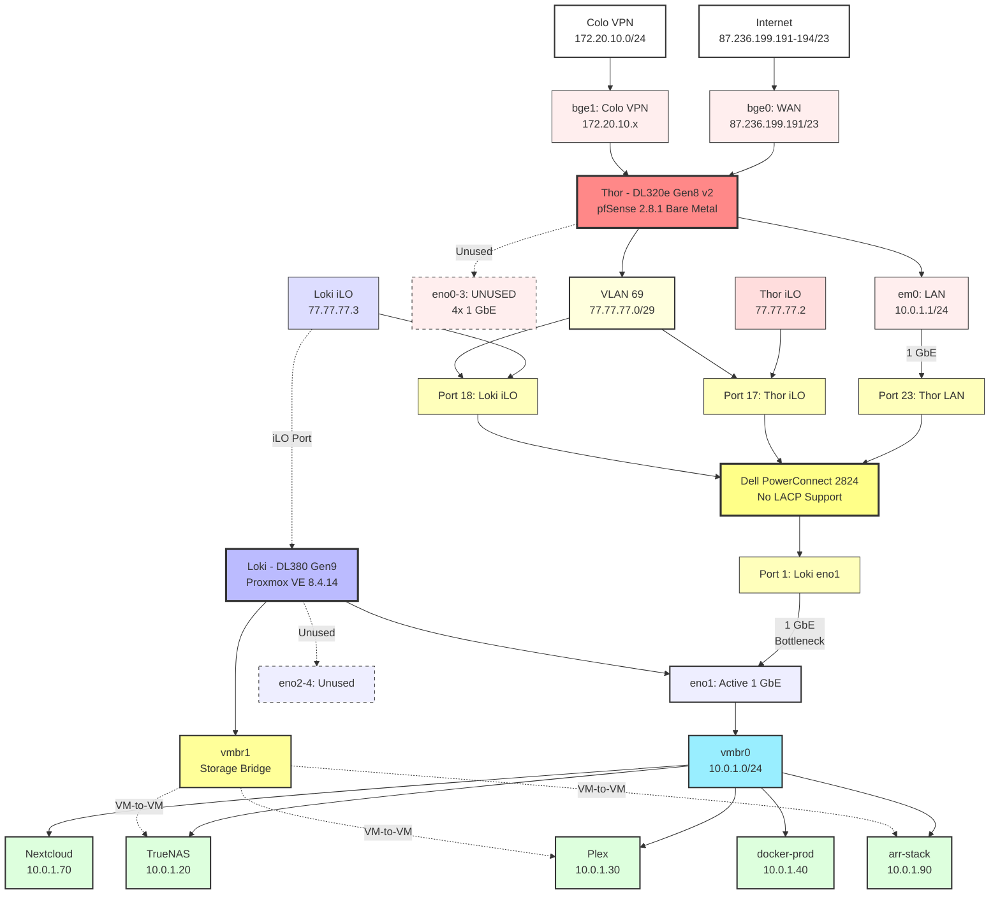

# 01 - Current State

## Current State - Infrastructure January 2026

**Document Date:** 2026-01-09 **Environment:** Colo Prague Production **Status:** PRE-HP Switch Installation (Dell PowerConnect 2824 in use)

* * *

## Executive Summary

Current infrastructure runs with **Dell PowerConnect 2824** switch providing basic L2 connectivity. DL320e operates pfSense bare metal, DL380 runs Proxmox VE 8.4.14 with 20 workloads (7 VMs + 13 LXCs). Single gigabit links without LACP due to switch limitations.

**Key Limitations:**

* ⚠️ No LACP support on current switch
* ⚠️ Limited VLAN configuration capability
* ⚠️ Single active link per server (no redundancy)
* ⚠️ 1 Gbps shared bandwidth for all workloads

**Timeline:** HP 1910-24G switch installation planned for **end of January 2026**.

* * *

## Physical Network Topology

### Network Diagram (Mermaid)



### ASCII Topology (Legacy)

```
                  [Internet] 87.236.199.191-194/23
                           ↓
      ┌────────────────────────────────────────────────┐
      │ Thor - DL320e Gen8 v2 (Bare Metal pfSense)     │
      │ - bge0: WAN (87.236.199.191/23)                │
      │ - bge1: Colo VPN (172.20.10.0/24) ───┐         │
      │ - em0: LAN via Switch Port 23        │         │
      │ - eno0-3: UNUSED (future LACP)       │         │
      └──────────────┬───────────────────────┼─────────┘
                     │                       │
                     │                   [pfSense]
                     │                   Firewall
                     │                       │
                     │                       ↓
      ┌──────────────┴──────────────────[VLAN 69]──────┐
      │ Dell PowerConnect 2824 Switch                  │
      │                                                │
      │ Port 23: Thor em0 (LAN + VLAN 69 tagged)       │
      │ Port 1:  Loki eno1 (LAN only)                  │
      │ Port 2-4: Loki eno2-4 (unused)                 │
      │ Port 17: Thor iLO (VLAN 69)                    │
      │ Port 18: Loki iLO (VLAN 69)                    │
      │ Port 24: Laptop (VLAN 69 tagged, on-site)      │
      └──────────────┬─────────────────────────────────┘
                     │
      ┌──────────────┴─────────────────────────────────┐
      │ Loki - DL380 Gen9 (Proxmox VE 8.4.14)          │
      │ - eno1: Active (vmbr0, 10.0.1.10/24) 1 GbE     │
      │ - eno2-4: DOWN (future LACP members)           │
      │ - 5 VMs + 9 LXCs running                       │
      └────────────────────────────────────────────────┘
```

**Colo VPN Security:**

* ✅ Colo VPN cable (bge1) terminates at pfSense
* ✅ Firewall rules control access to VLAN 69
* ✅ NOT directly exposed to switch/network
* Password: 18 chars (Colo-provided, no special chars)

* * *

## Network Segments

### 1\. WAN (Internet Uplink)

| Parameter  | Value                                |
| ---------- | ------------------------------------ |
| Interface  | Thor bge0                            |
| IPv4 Block | 87.236.199.191-194/23 (4 public IPs) |
| Gateway    | WANGW (Colo provider)                |
| IPv6       | 2a01:5f0:c001:108:1d::1/96           |

### 2\. LAN (Production Network)

| Parameter      | Value                   |
| -------------- | ----------------------- |
| Network        | 10.0.1.0/24             |
| Gateway        | 10.0.1.1 (Thor pfSense) |
| Thor Interface | em0 → Switch Port 23    |
| Loki Interface | eno1 → Switch Port 1    |
| DHCP Range     | 10.0.1.171-254          |
| Topology       | Flat (no VLANs)         |

**Bandwidth Limitation:** Single 1 GbE link shared by 14 active workloads (5 VMs + 9 LXCs).

### 3\. Management VLAN 69 (iLO Access)

| Parameter    | Value                                             |
| ------------ | ------------------------------------------------- |
| Network      | 77.77.77.0/29                                     |
| Gateway      | 77.77.77.1 (Thor pfSense)                         |
| Interface    | em0.69 (802.1Q tagged)                            |
| Switch Ports | 17 (Thor iLO), 18 (Loki iLO), 24 (Laptop on-site) |

**Physical Path:**

```
Colo VPN (bge1) → pfSense → em0.69 (VLAN 69) → Switch (tagged)
                                                     ↓
                                        ┌────────────┴────────────┐
                                        │                         │
                            iLO Dedicated Ports          Port 24 (Laptop)
                                   ↓        ↓
                           Thor iLO    Loki iLO
                          77.77.77.2  77.77.77.3
```

**Note:** iLO traffic does NOT traverse main data NICs (eno1/em0). HP servers have dedicated hardware iLO ports with physical separation.

### 4\. Colo VPN (Out-of-Band Management)

| Parameter | Value                                  |
| --------- | -------------------------------------- |
| Network   | 172.20.10.0/24                         |
| Interface | Thor bge1                              |
| Purpose   | OOB access to VLAN 69 (iLO management) |
| Security  | Firewall-controlled (pfSense rules)    |

### 5\. WireGuard VPN

| Parameter | Value                |
| --------- | -------------------- |
| Network   | 182.22.16.0/29       |
| Interface | tun\_wg0 (pfSense)   |
| Purpose   | Secure remote access |

* * *

## Hardware Configuration

### Thor - HP DL320e Gen8 v2

**Role:** pfSense Firewall (bare metal) **CPU:** Intel Xeon E3-1230L v3 @ 1.80GHz (4C/8T) **RAM:** 16GB DDR3 ECC **Storage:** 2x Patriot P210 128GB SSD (ZFS Mirror)

**Storage Health:**

* ada0: PASSED, 98% life remaining, 17,989h power-on
* ada1: PASSED, 98% life remaining, 17,779h power-on
* Health: Excellent (0 errors, 0 reallocated sectors)

**NICs:**

* bge0, bge1: Broadcom BCM5720 (onboard)
* eno0-3: Intel 82571EB 4-port (Add-on, **individually passthrough-capable**)

### Loki - HP DL380 Gen9

**Role:** Proxmox Compute Hypervisor **CPU:** 2x Xeon E5-2640 v4 @ 2.40GHz (40 threads) **RAM:** 128GB DDR4 ECC (86% utilized - 110.4GB used, 84GB VMs + ~26GB LXCs/system) **GPU:** NVIDIA Quadro P2200 (Plex HW transcoding)

**Proxmox:**

* Version: 8.4.14 (pve-manager/8.4.14/b502d23c55afcba1)
* Kernel: Linux 6.8.12-17-pve
* Uptime: 23.5 hours
* Load: 3.34, 2.80, 2.39

**NICs:**

* eno1: UP (vmbr0, 10.0.1.10/24)
* eno2-4: DOWN (future LACP members)

* * *

## Virtual Machines (5 total, 5 running)

| VMID | Name           | Status    | vCPU | RAM   | IP        | Purpose                |
| ---- | -------------- | --------- | ---- | ----- | --------- | ---------------------- |
| 1000 | pms-prod-cz-01 | ✅ running | 10   | 24 GB | 10.0.1.30 | Plex (GPU passthrough) |
| 1100 | the-arr-stack  | ✅ running | 8    | 8 GB  | 10.0.1.90 | Sonarr, Radarr, etc.   |
| 2000 | docker-prod    | ✅ running | 12   | 12 GB | 10.0.1.40 | Portainer stack        |
| 4000 | truenas        | ✅ running | 6    | 32 GB | 10.0.1.20 | Storage (NFS/SMB)      |
| 8000 | nextcloud      | ✅ running | 12   | 8 GB  | 10.0.1.70 | File sync              |

**Total:** 84 GB RAM allocated (128 GB available)

**Note:** Mailcow VM removed - service runs on dedicated Netcup VPS (89.58.12.131) since April 2022 with excellent mail reputation.

* * *

## LXC Containers (13 total, 9 running)

| VMID | Name               | Status | RAM    | IP         | Purpose             |
| ---- | ------------------ | ------ | ------ | ---------- | ------------------- |
| 3000 | prometheus         | ✅      | 256 MB | 10.0.1.80  | Metrics             |
| 3002 | influxdb           | ✅      | 2 GB   | 10.0.1.82  | Time-series DB      |
| 5000 | ptero-panel-prod   | ✅      | 1 GB   | 10.0.1.100 | Game hosting panel  |
| 5001 | ptero-wings-prod   | ✅      | 32 GB  | 10.0.1.101 | Game hosting engine |
| 5050 | ptero-mariadb      | ✅      | 1 GB   | 10.0.1.150 | Database            |
| 5998 | ptero-wings-dev    | ⏹️     | 4 GB   | 10.0.1.113 | Development         |
| 5999 | ptero-panel-dev    | ⏹️     | 4 GB   | 10.0.1.111 | Development         |
| 6000 | netbox             | ✅      | 2 GB   | 10.0.1.60  | IPAM/DCIM           |
| 6100 | trilium            | ✅      | 512 MB | 10.0.1.160 | Notes               |
| 6101 | syncthing          | ⏹️     | 2 GB   | 10.0.1.170 | File sync           |
| 6102 | vscode             | ⏹️     | 8 GB   | 10.0.1.161 | IDE                 |
| 6103 | ptero-panel-dev-02 | ⏹️     | 4 GB   | DHCP       | Development         |
| 9000 | graylog            | ✅      | 12 GB  | DHCP       | Logs                |

**Total:** 72.7 GB RAM allocated

* * *

## pfSense Configuration

**Version:** 2.8.1-RELEASE **Hostname:** fw-prod-cz-thor.getinn.top **WebGUI:** [https://fw-prod-cz-thor.getinn.top:10443](https://fw-prod-cz-thor.getinn.top:10443)

### Interfaces

| Interface      | Physical | IP                | Description |
| -------------- | -------- | ----------------- | ----------- |
| WAN            | bge0     | 87.236.199.191/23 | Internet    |
| LAN            | em0      | 10.0.1.1/24       | Production  |
| MGT (opt1)     | em0.69   | 77.77.77.1/29     | iLO VLAN    |
| VPN (opt2)     | bge1     | 172.20.10.1/24    | Colo VPN    |
| WG\_VPN (opt3) | tun\_wg0 | 182.22.16.1/29    | WireGuard   |

### DHCP Static Leases (22 total)

**Management (VLAN 69):**

* 77.77.77.2 - Thor iLO
* 77.77.77.3 - Loki iLO

**LAN (10.0.1.0/24):** (18 active static leases)

* 10.0.1.10 - pve-prod-cz-loki (Proxmox host)
* 10.0.1.20 - truenas-prod-cz-01
* 10.0.1.30 - pms-prod-cz-01 (Plex)
* 10.0.1.40 - docker-prod-cz-01
* 10.0.1.60 - netbox-prod-cz-01
* 10.0.1.70 - nextcloud-prod-cz-01
* 10.0.1.80 - prometheus-prod-cz-01
* 10.0.1.82 - influxdb-prod-cz-01
* 10.0.1.90 - the-arr-stack-prod-cz-01
* 10.0.1.100-101 - Pterodactyl (panel, wings) - Production
* 10.0.1.111, 113, 114 - Pterodactyl Dev instances
* 10.0.1.150 - ptero-mariadb-prod
* 10.0.1.160 - trilium-prod-cz-01
* 10.0.1.161 - vscode-prod-cz-01
* 10.0.1.170 - syncthing-prod-cz-01

* * *

## Dell PowerConnect 2824 Switch (Current)

**Limitations:**

* ❌ No LACP/802.3ad support
* ❌ Limited VLAN features
* ⚠️ Basic web management only

**Port Mapping:**

| Port(s) | Device      | VLAN           | Usage                        |
| ------- | ----------- | -------------- | ---------------------------- |
| 1-4     | Loki eno1-4 | Untagged       | Only port 1 active (no LACP) |
| 17      | Thor iLO    | VLAN 69        | Management                   |
| 18      | Loki iLO    | VLAN 69        | Management                   |
| 23      | Thor em0    | Untagged       | LAN                          |
| 24      | Laptop      | VLAN 69 tagged | On-site access               |

**Reason for Replacement:** Cannot configure LACP needed for DL380 4x GbE aggregation.

* * *

## External Services

### Mailcow (Netcup VPS)

* **IP:** 89.58.12.131/22
* **Platform:** Mailcow Dockerized
* **Containers:** 19 (Postfix, Dovecot, Rspamd, SOGo, MariaDB, etc.)
* **Uptime:** Running since April 28, 2022
* **Note:** Keeping on Netcup for excellent established mail reputation (3+ years)

### n8n (Hetzner VPS)

* **IP:** 46.224.135.0/32
* **Platform:** Coolify
* **Containers:** 6

### Hetzner Storage Box

* **Capacity:** 1TB
* **Purpose:** Proxmox backup target (planned)
* **Status:** Underutilized

* * *

## Known Issues & Risks

### Critical

1. **❌ No Link Aggregation**

   * Switch limitation prevents LACP
   * Loki has 3x idle GbE ports (eno2-4)
   * Thor has 4x idle GbE ports (eno0-3)

2. **❌ Bandwidth Bottleneck**

   * Single 1 GbE link for 14 active workloads
   * Plex (HW transcoding) + arr-stack + TrueNAS saturate link

3. **❌ No Redundancy**

   * Single link failure = complete outage

### Medium

1. **⚠️ High RAM Utilization**

   * 87% usage (110.4 GB / 128 GB)
   * Swap: 582 MB active (memory pressure)

2. **⚠️ Flat Network**

   * All services on 10.0.1.0/24
   * No traffic isolation

### Low

1. **ℹ️ No Systematic Backups**

   * Hetzner Storage Box ready but not configured
   * pfSense config: no auto-backup

2. **ℹ️ Minimal Monitoring Usage**

   * Prometheus/Grafana/Graylog deployed
   * Dashboards rarely checked (except Plex)
   * Alerting: only backup notifications

* * *

## Monitoring & Observability

**Deployed Tools:**

* ✅ Prometheus (10.0.1.80) - metrics collection
* ✅ InfluxDB v2 (10.0.1.82) - time-series storage
* ✅ Graylog (DHCP) - log aggregation
* ⚠️ Grafana - assumed deployed, minimal usage

**Current State:**

* Monitoring stack operational
* **Usage:** Low (only Plex dashboard actively viewed)
* **Alerting:** Partial (backup notifications only)
* **SLA Monitoring:** Not configured

* * *

## Backup & Disaster Recovery

**Current Status:**

| System            | Backup Status      | Target              | Frequency |
| ----------------- | ------------------ | ------------------- | --------- |
| Mailcow (Netcup)  | ✅ Configured       | Borgmatic           | Automated |
| Vaultwarden       | ✅ Migrated         | RS1000              | Safe      |
| Nextcloud data    | ⚠️ On TrueNAS pool | None (healthy pool) | \-        |
| Proxmox VMs       | ❌ None             | Planned: Hetzner SB | \-        |
| pfSense config    | ❌ Manual only      | None                | On-demand |
| Disaster Recovery | ❌ No runbook       | \-                  | \-        |

**Planned:**

* Mount Hetzner Storage Box in Proxmox
* Configure vzdump/PBS to Storage Box
* Implement retention policy

* * *

## Certificate Management

**Method:** ACME (Let's Encrypt) **Provider:** Cloudflare DNS-01 challenge **Certificate:** Wildcard `*.getinn.top` **Renewal:** Automated

**Benefits:**

* Single cert for all subdomains
* No per-service management
* Auto-renewal

* * *

## DNS Configuration

**External:** Cloudflare (authoritative for getinn.top) **Internal (Home):** Pi-hole **Internal (Colo):** pfSense Unbound

**Current Issues:**

* No documented DNS records
* No split-DNS configured
* Setup not fully understood

* * *

## Service Dependencies

```
Internet → Thor pfSense (SPOF) → Dell Switch → Loki Proxmox → Workloads
                    ↓
            [Firewall Rules] → VLAN 69 → iLOs
```

**Single Points of Failure:**

* pfSense (no HA)
* Dell Switch (no redundancy)
* eno1 link (no LACP)

* * *

## Document Status

**Status:** CURRENT (2026-01-09) **Data Sources:**

* Proxmox API (live)
* pfSense config export
* SMART data (Thor storage)
* User corrections

**Next Update:** After HP switch installation (Feb 2026)

* * *

## Related Documents

* [Hardware Inventory](hardware-inventory.md)
* [Target State](02-target-state.md) - Post-HP switch architecture
* [Migration Plan](03-migration-plan.md) - Switch installation procedure
