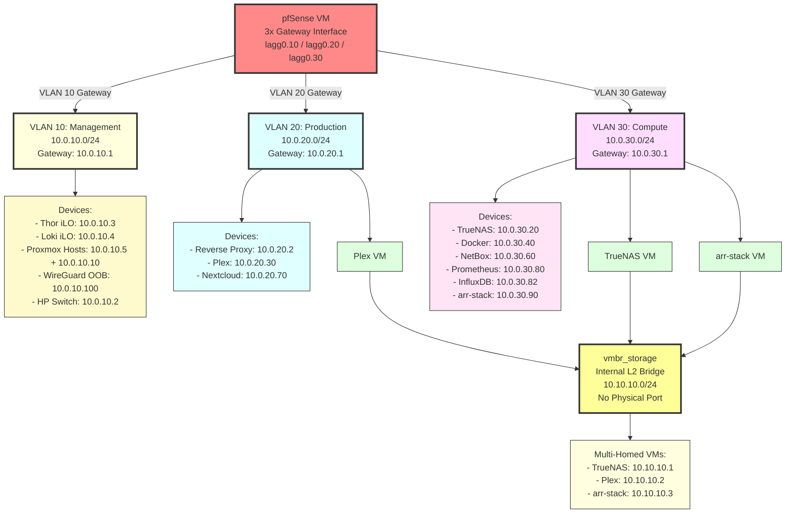

# 02 - Target State

## Target State - Post-Migration Architecture

**Document Date:** 2026-01-09 **Target Date:** End of January 2026 (31 Jan - 1 Feb) **Environment:** Colo Prague Production **Status:** PLANNED (Pre-Implementation)

* * *

## Executive Summary

Target infrastructure after HP 1910-24G switch installation and DL320e Proxmox migration. Key improvements: LACP link aggregation (4 Gbps), VLAN segmentation (Management/Production/Compute), DL320e virtualization (pfSense as VM), and secure Out-of-Band management via WireGuard Gateway LXC.

**Key Improvements:**

* ✅ 4x bandwidth via LACP (1 Gbps → 4 Gbps aggregate)
* ✅ Network segmentation (3 VLANs + internal storage network)
* ✅ Redundancy (link failover via LACP)
* ✅ Secure OOB access (WireGuard Gateway for Colo VPN → iLO)
* ✅ DL320e as Proxmox host (pfSense virtualized)
* ✅ Reverse Proxy LXC (central ingress point)

**Migration Window:** 31 Jan - 1 Feb 2026 (on-site in Colo Prague)

* * *

## Physical Network Topology

### Network Diagram (Mermaid)

```mermaid
flowchart TB
    %% External Networks
    Internet["Internet<br/>87.236.199.191-194/23"]
    ColoVPN["Colo VPN<br/>172.20.10.0/24"]

    %% Thor DL320e Components
    Thor_bge0["bge0: WAN Passthrough<br/>87.236.199.191/23"]
    Thor_bge1["bge1: Colo VPN<br/>172.20.10.x"]
    Thor_eno01["eno0+eno1 LACP<br/>Passthrough to pfSense"]
    Thor_eno2["eno2: Management<br/>VLAN 10 untagged"]
    Thor_vmbr_mgmt["vmbr_mgmt<br/>10.0.10.5/24"]
    Thor_vmbr_oob["vmbr_oob<br/>172.20.10.10/24"]
    Thor_pfSense["pfSense VM<br/>3x NIC Passthrough<br/>bge0+eno0+eno1"]
    Thor_ReverseProxy["Reverse Proxy LXC<br/>VLAN 20: 10.0.20.2"]
    Thor_WG_OOB["WireGuard OOB LXC<br/>172.20.10.100 + 10.0.10.100"]

    %% HP 1910-24G Switch
    HP_Switch["HP 1910-24G Switch"]
    HP_LAG1["LAG1: Ports 1-2<br/>LACP 802.3ad"]
    HP_LAG2["LAG2: Ports 9-12<br/>LACP 802.3ad"]
    HP_Port3["Port 3<br/>Thor eno2 VLAN 10"]
    HP_Port17["Port 17<br/>Thor iLO VLAN 10"]
    HP_Port18["Port 18<br/>Loki iLO VLAN 10"]
    HP_Mgmt["Mgmt IP: 10.0.10.2"]

    %% VLANs
    VLAN10["VLAN 10: Management<br/>10.0.10.0/24"]
    VLAN20["VLAN 20: Production<br/>10.0.20.0/24"]
    VLAN30["VLAN 30: Compute<br/>10.0.30.0/24"]

    %% iLOs
    Thor_iLO["Thor iLO<br/>10.0.10.3"]
    Loki_iLO["Loki iLO<br/>10.0.10.4"]

    %% Loki DL380 Components
    Loki_bond0["bond0: eno1-4<br/>LACP 802.3ad<br/>4x 1 GbE = 4 Gbps"]
    Loki_vmbr0["vmbr0: VLAN-aware Bridge<br/>tagged VLANs 10,20,30"]
    Loki_vmbr_storage["vmbr_storage<br/>Internal L2 bridge<br/>10.10.10.0/24"]

    %% Loki VMs Multi-Homed
    TrueNAS["TrueNAS VM<br/>net0: VLAN 30 10.0.30.20<br/>net1: storage 10.10.10.1"]
    Plex["Plex VM<br/>net0: VLAN 20 10.0.20.30<br/>net1: storage 10.10.10.2"]
    ArrStack["arr-stack VM<br/>net0: VLAN 30 10.0.30.90<br/>net1: storage 10.10.10.3"]
    Nextcloud["Nextcloud VM<br/>VLAN 20: 10.0.20.70"]

    %% Loki LXCs
    Prometheus["Prometheus LXC<br/>VLAN 30: 10.0.30.80"]
    Grafana["Grafana LXC<br/>VLAN 30: 10.0.30.81"]
    LXC_Others["Other LXCs<br/>VLANs 20/30"]

    %% Internet -> Thor WAN
    Internet --> Thor_bge0
    ColoVPN --> Thor_bge1

    %% Thor: Passthrough paths
    Thor_bge0 --> Thor_pfSense
    Thor_bge1 --> Thor_vmbr_oob
    Thor_eno01 --> Thor_pfSense
    Thor_eno01 -->|LACP 4Gbps| HP_LAG1

    %% Thor: Management path
    Thor_eno2 --> Thor_vmbr_mgmt
    Thor_vmbr_mgmt --> HP_Port3

    %% Thor: OOB Gateway
    Thor_vmbr_oob --> Thor_WG_OOB

    %% Thor: Reverse Proxy
    Thor_ReverseProxy -.->|via vmbr0.20| VLAN20

    %% Switch core
    HP_Switch --> HP_LAG1
    HP_Switch --> HP_LAG2
    HP_Switch --> HP_Port3
    HP_Switch --> HP_Port17
    HP_Switch --> HP_Port18
    HP_Switch --> HP_Mgmt
    HP_LAG1 --> VLAN10
    HP_LAG1 --> VLAN20
    HP_LAG1 --> VLAN30
    HP_LAG2 --> VLAN10
    HP_LAG2 --> VLAN20
    HP_LAG2 --> VLAN30

    %% Thor iLO path
    Thor_iLO --> HP_Port17
    HP_Port17 --> VLAN10

    %% Loki: LACP bond
    Loki_bond0 -->|LACP 4Gbps| HP_LAG2
    Loki_bond0 --> Loki_vmbr0

    %% Loki: VLAN bridge
    Loki_vmbr0 --> VLAN10
    Loki_vmbr0 --> VLAN20
    Loki_vmbr0 --> VLAN30

    %% Loki: Multi-homed VMs
    Loki_vmbr0 --> TrueNAS
    Loki_vmbr0 --> Plex
    Loki_vmbr0 --> ArrStack
    Loki_vmbr0 --> Nextcloud

    %% Loki: LXCs
    Loki_vmbr0 --> Prometheus
    Loki_vmbr0 --> Grafana
    Loki_vmbr0 --> LXC_Others

    %% Loki iLO path
    Loki_iLO --> HP_Port18
    HP_Port18 --> VLAN10

    %% Loki: Storage network
    Loki_vmbr_storage -.->|Virtual bridge<br/>Multi-Gbps| TrueNAS
    Loki_vmbr_storage -.->|Virtual bridge<br/>Multi-Gbps| Plex
    Loki_vmbr_storage -.->|Virtual bridge<br/>Multi-Gbps| ArrStack

    %% OOB Access
    Thor_WG_OOB -.->|OOB Secure<br/>Access| Thor_iLO
    Thor_WG_OOB -.->|OOB Secure<br/>Access| Loki_iLO

    %% Styling
    style Internet fill:#fff,stroke:#333,stroke-width:2px
    style ColoVPN fill:#fff,stroke:#333,stroke-width:2px
    style Thor_pfSense fill:#f88,stroke:#333,stroke-width:3px
    style Thor_bge0 fill:#fee,stroke:#333
    style Thor_bge1 fill:#fee,stroke:#333
    style Thor_eno01 fill:#fee,stroke:#333
    style Thor_vmbr_mgmt fill:#fef,stroke:#333
    style Thor_vmbr_oob fill:#fef,stroke:#333
    style Thor_WG_OOB fill:#f8f,stroke:#333
    style Thor_ReverseProxy fill:#f8f,stroke:#333
    style HP_Switch fill:#9f9,stroke:#333,stroke-width:3px
    style HP_LAG1 fill:#bfb,stroke:#333,stroke-width:2px
    style HP_LAG2 fill:#bfb,stroke:#333,stroke-width:2px
    style VLAN10 fill:#ffd,stroke:#333,stroke-width:2px
    style VLAN20 fill:#dff,stroke:#333,stroke-width:2px
    style VLAN30 fill:#fdf,stroke:#333,stroke-width:2px
    style Thor_iLO fill:#fee,stroke:#333
    style Loki_iLO fill:#fee,stroke:#333
    style Loki_bond0 fill:#bfb,stroke:#333,stroke-width:2px
    style Loki_vmbr0 fill:#eef,stroke:#333,stroke-width:2px
    style Loki_vmbr_storage fill:#ff9,stroke:#333,stroke-width:3px
    style TrueNAS fill:#dfd,stroke:#333,stroke-width:2px
    style Plex fill:#dfd,stroke:#333,stroke-width:2px
    style ArrStack fill:#dfd,stroke:#333,stroke-width:2px
    style Nextcloud fill:#dfd,stroke:#333,stroke-width:2px
    style Prometheus fill:#fef,stroke:#333
    style Grafana fill:#fef,stroke:#333
```



### ASCII Topology (Legacy)

```
                  [Internet] 87.236.199.191-194/23
                           ↓
      ┌────────────────────────────────────────────────┐
      │ Thor - DL320e Gen8 v2 (Proxmox VE)             │
      │                                                │
      │ bge0: WAN (passthrough to pfSense VM)          │
      │ bge1: Colo VPN → vmbr_oob ──────────┐          │
      │                                     │          │
      │ eno0+eno1: LACP (passthrough to     │          │
      │            pfSense VM)              │          │
      │            ↓ Switch Ports 1-2       │          │
      │                                     │          │
      │ eno2: Proxmox Management (VLAN 10)  │          │
      │       → vmbr_mgmt                   │          │
      │       ↓ Switch Port 3               │          │
      │                                     │          │
      │ eno3: Reserve (unused)              │          │
      │                                     │          │
      │ Workloads:                          │          │
      │ - pfSense VM (3 NICs passthrough)   │          │
      │ - Reverse Proxy LXC                 │          │
      │ - WireGuard OOB Gateway LXC ────────┘          │
      └──────────────┬─────────────────────────────────┘
                     │ LAG1 (Ports 1-2)
                     │ LACP 802.3ad
                     ↓
      ┌────────────────────────────────────────────────┐
      │ HP 1910-24G Switch                             │
      │                                                │
      │ Management: 10.0.10.2 (VLAN 10)                │
      │                                                │
      │ LAG1 (1-2):  Thor LACP (VLANs 10,20,30)        │
      │ LAG2 (9-12): Loki LACP (VLANs 10,20,30)        │
      │ Port 3:      Thor eno2 (VLAN 10 mgmt)          │
      │ Port 17:     Thor iLO (VLAN 10)                │
      │ Port 18:     Loki iLO (VLAN 10)                │
      │ Port 24:     Laptop on-site (VLAN 10 tagged)   │
      └──────────────┬─────────────────────────────────┘
                     │ LAG2 (Ports 9-12)
                     │ LACP 802.3ad
                     ↓
      ┌────────────────────────────────────────────────┐
      │ Loki - DL380 Gen9 (Proxmox VE 8.4.14)          │
      │                                                │
      │ bond0 (eno1-4): LACP 802.3ad                   │
      │                 → vmbr0 (VLAN-aware bridge)    │
      │                 VLANs: 10, 20, 30              │
      │                                                │
      │ vmbr_storage: Internal storage (no physical)   │
      │               TrueNAS ↔ Plex ↔ arr-stack       │
      │               Multi-Gbps virtual bandwidth     │
      │                                                │
      │ Workloads:                                     │
      │ - 5 VMs (multi-VLAN capable)                   │
      │ - 9+ LXCs (distributed across VLANs)           │
      └────────────────────────────────────────────────┘
```

* * *

## VLAN Design

### VLAN Architecture Overview



### VLAN 10 - Management (10.0.10.0/24)

**Purpose:** Infrastructure management and Out-of-Band access **Gateway:** 10.0.10.1 (pfSense)

**Devices:**

| IP              | Device                      | Description                        |
| --------------- | --------------------------- | ---------------------------------- |
| 10.0.10.1       | pfSense (VLAN 10 interface) | Gateway                            |
| 10.0.10.2       | HP 1910-24G Switch          | Management IP                      |
| 10.0.10.3       | Thor iLO                    | Out-of-Band management             |
| 10.0.10.4       | Loki iLO                    | Out-of-Band management             |
| 10.0.10.5       | Thor Proxmox Host           | eno2 management interface          |
| 10.0.10.10      | Loki Proxmox Host           | Management IP on vmbr0.10          |
| 10.0.10.100     | WireGuard OOB Gateway LXC   | Secure Colo VPN → iLO access       |
| 10.0.10.200-250 | DHCP Pool                   | On-site laptops, temporary devices |

**Access Control:**

* Only accessible via:
  * pfSense WireGuard User VPN (182.22.16.0/29)
  * WireGuard OOB Gateway (via Colo VPN)
  * Physical console/iLO
* Blocked from all other VLANs

**Note:** VLAN 69 (77.77.77.0/29) will be **migrated** to VLAN 10. iLO IPs change:

* Thor iLO: 77.77.77.2 → 10.0.10.3
* Loki iLO: 77.77.77.3 → 10.0.10.4

* * *

### VLAN 20 - Production (10.0.20.0/24)

**Purpose:** Public-facing services (externally accessible) **Gateway:** 10.0.20.1 (pfSense)

**Devices:**

| IP          | Device                      | Description                     |
| ----------- | --------------------------- | ------------------------------- |
| 10.0.20.1   | pfSense (VLAN 20 interface) | Gateway                         |
| 10.0.20.2   | Reverse Proxy LXC           | Traefik/Caddy (central ingress) |
| 10.0.20.30  | Plex VM (net0)              | External access interface       |
| 10.0.20.70  | Nextcloud VM                | File sync & collaboration       |
| 10.0.20.100 | Pterodactyl Panel LXC       | Game hosting panel (optional)   |

**Access Control:**

* Reverse Proxy (10.0.20.2) can accept WAN traffic (ports 80/443)
* Services behind Reverse Proxy (Plex, Nextcloud) proxied
* No direct access from VLAN 20 → VLAN 30 or VLAN 10
* Routing to other VLANs controlled by pfSense firewall rules

**Port Forwards (WAN → VLAN 20):**

* 80/tcp → 10.0.20.2 (Reverse Proxy HTTP)
* 443/tcp → 10.0.20.2 (Reverse Proxy HTTPS)
* 32400/tcp → 10.0.20.30 (Plex direct access, optional)

* * *

### VLAN 30 - Compute (10.0.30.0/24)

**Purpose:** Internal services and inter-service communication **Gateway:** 10.0.30.1 (pfSense)

**Devices:**

| IP          | Device                      | Description              |
| ----------- | --------------------------- | ------------------------ |
| 10.0.30.1   | pfSense (VLAN 30 interface) | Gateway                  |
| 10.0.30.20  | TrueNAS VM (net0)           | Management interface     |
| 10.0.30.40  | Docker-prod VM              | General Docker workloads |
| 10.0.30.60  | NetBox LXC                  | IPAM/DCIM                |
| 10.0.30.80  | Prometheus LXC              | Metrics collection       |
| 10.0.30.82  | InfluxDB LXC                | Time-series database     |
| 10.0.30.90  | arr-stack VM (net0)         | Sonarr, Radarr, etc.     |
| 10.0.30.100 | Pterodactyl Panel LXC       | Game hosting panel       |
| 10.0.30.101 | Pterodactyl Wings LXC       | Game hosting engine      |
| 10.0.30.150 | Pterodactyl MariaDB LXC     | Database                 |
| 10.0.30.160 | Trilium LXC                 | Note-taking              |
| 10.0.30.200 | Graylog LXC                 | Log aggregation          |

**Access Control:**

* Full inter-VLAN 30 communication allowed
* Can initiate connections to VLAN 20 services (via Reverse Proxy)
* Blocked from VLAN 10 (management)
* Accessible via pfSense WireGuard User VPN

* * *

### vmbr_storage - Internal Storage Network (10.10.10.0/24)

**Purpose:** High-throughput VM-to-VM storage traffic (virtual bridge, no physical NIC) **Gateway:** None (no routing, isolated L2 domain)

**Devices:**

| IP         | Device              | Description               |
| ---------- | ------------------- | ------------------------- |
| 10.10.10.1 | TrueNAS VM (net1)   | NFS/SMB storage interface |
| 10.10.10.2 | Plex VM (net1)      | Media access from TrueNAS |
| 10.10.10.3 | arr-stack VM (net1) | Download/move to TrueNAS  |

**Characteristics:**

* **No physical NIC:** Traffic never leaves Proxmox host
* **Bandwidth:** Limited only by RAM/CPU (multi-Gbps virtual)
* **Latency:** Minimal (kernel-level bridging)
* **Isolation:** Completely separate from routed VLANs

**Design Decision:**

* Virtual bridge = faster than 1 GbE physical link
* No switch overhead
* Currently named vmbr1, will be renamed to vmbr_storage during migration

* * *

## DL320e Gen8 v2 - Proxmox Hypervisor

### NIC Allocation

**Passthrough to pfSense VM:**

| Physical NIC | PCIe Address | Function      | Connected To                 |
| ------------ | ------------ | ------------- | ---------------------------- |
| bge0         | 0000:03:00.0 | WAN           | Internet (87.236.199.191/23) |
| eno0         | 0000:09:00.0 | LACP Member 1 | Switch Port 1 (LAG1)         |
| eno1         | 0000:09:00.1 | LACP Member 2 | Switch Port 2 (LAG1)         |

**Remains with Proxmox Host:**

| Physical NIC | PCIe Address | Function           | Connected To               |
| ------------ | ------------ | ------------------ | -------------------------- |
| bge1         | 0000:03:00.1 | Colo VPN           | vmbr\_oob (172.20.10.0/24) |
| eno2         | 0000:10:00.0 | Proxmox Management | Switch Port 3 (VLAN 10)    |
| eno3         | 0000:10:00.1 | Reserve            | Unused (future expansion)  |

* * *

### Proxmox Network Configuration

**File:** `/etc/network/interfaces`

```sh
# Loopback
auto lo
iface lo inet loopback

# Management Interface (VLAN 10)
auto eno2
iface eno2 inet manual

auto vmbr_mgmt
iface vmbr_mgmt inet static
    address 10.0.10.5/24
    gateway 10.0.10.1
    bridge-ports eno2
    bridge-stp off
    bridge-fd 0
    comments Proxmox Management - VLAN 10

# Colo VPN (Out-of-Band)
auto bge1
iface bge1 inet manual

auto vmbr_oob
iface vmbr_oob inet static
    address 172.20.10.10/24
    bridge-ports bge1
    bridge-stp off
    bridge-fd 0
    comments Colo VPN - Isolated for WireGuard OOB Gateway

# Virtual Bridge for LXCs/VMs (VLAN-aware)
auto vmbr0
iface vmbr0 inet manual
    bridge-ports none
    bridge-stp off
    bridge-fd 0
    bridge-vlan-aware yes
    bridge-vids 10 20 30
    comments VLAN-aware bridge for LXCs (no physical port)
```

**Notes:**

* `vmbr_mgmt`: Physical connection to switch (VLAN 10)
* `vmbr_oob`: Isolated for Colo VPN (no routing to other VLANs)
* `vmbr0`: VLAN-aware for LXCs (Reverse Proxy, WireGuard OOB)
* NICs bge0, eno0, eno1: **Not configured** (passthrough to pfSense VM)

* * *

### DL320e Workloads

**pfSense VM (VMID TBD):**

* **vCPU:** 4
* **RAM:** 4 GB
* **Disk:** 16 GB
* **NICs (Passthrough):**
  * hostpci0: bge0 (WAN)
  * hostpci1: eno0 (LACP1)
  * hostpci2: eno1 (LACP2)
* **Function:** Firewall, Router, VPN Gateway

**Reverse Proxy LXC (VMID TBD):**

* **vCPU:** 2
* **RAM:** 512 MB
* **Disk:** 4 GB
* **NIC:** VLAN 20 (vmbr0.20)
* **IP:** 10.0.20.2
* **Software:** Traefik or Caddy
* **Function:** Central ingress (WAN → internal services)

**WireGuard OOB Gateway LXC (VMID TBD):**

* **vCPU:** 1
* **RAM:** 256 MB
* **Disk:** 2 GB
* **NICs:**
  * net0: vmbr\_oob (172.20.10.100/24) - Colo VPN side
  * net1: VLAN 10 (vmbr0.10, 10.0.10.100/24) - Management side
* **Function:** Secure gateway Colo VPN → iLO access
* **Firewall:** iptables (only SSH/HTTPS to iLOs)

* * *

## DL380 Gen9 - Proxmox Compute Host

### Network Configuration

**File:** `/etc/network/interfaces`

```sh
# Loopback
auto lo
iface lo inet loopback

# LACP Bond (eno1-4)
auto eno1
iface eno1 inet manual

auto eno2
iface eno2 inet manual

auto eno3
iface eno3 inet manual

auto eno4
iface eno4 inet manual

auto bond0
iface bond0 inet manual
    bond-slaves eno1 eno2 eno3 eno4
    bond-mode 802.3ad
    bond-miimon 100
    bond-xmit-hash-policy layer3+4
    bond-lacp-rate fast

# Main Bridge (VLAN-aware)
auto vmbr0
iface vmbr0 inet static
    address 10.0.30.10/24
    gateway 10.0.30.1
    bridge-ports bond0
    bridge-stp off
    bridge-fd 0
    bridge-vlan-aware yes
    bridge-vids 10 20 30
    comments VLAN-aware bridge on LACP bond

# VLAN 10 sub-interface (Management)
auto vmbr0.10
iface vmbr0.10 inet static
    address 10.0.10.10/24
    comments Management VLAN

# Internal Storage Network (no physical port)
auto vmbr_storage
iface vmbr_storage inet manual
    bridge-ports none
    bridge-stp off
    bridge-fd 0
    comments Internal storage network (TrueNAS ↔ Plex ↔ arr-stack)
```

**Notes:**

* `bond0`: 4x 1 GbE LACP = 4 Gbps aggregate
* `vmbr0`: VLAN-aware bridge (10, 20, 30)
* `vmbr0.10`: Management IP in VLAN 10
* `vmbr_storage`: Virtual-only bridge (no bandwidth limit)

* * *

## Multi-Homed VMs/LXCs

### Plex VM (VMID 1000)

**NICs:**

* **net0:** vmbr0, VLAN 20, 10.0.20.30
  * Purpose: External access (WAN → Reverse Proxy → Plex)
* **net1:** vmbr_storage, 10.10.10.2
  * Purpose: TrueNAS media access + arr-stack communication

**Routing:**

* Default route: 10.0.20.1 (VLAN 20 gateway)
* Static route: 10.10.10.0/24 via net1 (direct)

* * *

### arr-stack VM (VMID 1100)

**NICs:**

* **net0:** vmbr0, VLAN 30, 10.0.30.90
  * Purpose: Management, Reverse Proxy access
* **net1:** vmbr_storage, 10.10.10.3
  * Purpose: TrueNAS download/move access

**Routing:**

* Default route: 10.0.30.1 (VLAN 30 gateway)
* Static route: 10.10.10.0/24 via net1

* * *

### TrueNAS VM (VMID 4000)

**NICs:**

* **net0:** vmbr0, VLAN 30, 10.0.30.20
  * Purpose: Management, general access
* **net1:** vmbr_storage, 10.10.10.1
  * Purpose: NFS/SMB storage serving

**Routing:**

* Default route: 10.0.30.1 (VLAN 30 gateway)
* NFS/SMB shares: Bind to 10.10.10.1

* * *

### Other VMs (single-homed)

**Nextcloud VM (VMID 8000):**

* net0: vmbr0, VLAN 20, 10.0.20.70
* Storage: Local disk (not TrueNAS)

**docker-prod VM (VMID 2000):**

* net0: vmbr0, VLAN 30, 10.0.30.40

* * *

### LXCs (single-homed, VLAN-tagged)

**VLAN 30 (Compute):**

* Prometheus (3000): 10.0.30.80
* InfluxDB (3002): 10.0.30.82
* Pterodactyl Panel (5000): 10.0.30.100
* Pterodactyl Wings (5001): 10.0.30.101
* Pterodactyl MariaDB (5050): 10.0.30.150
* NetBox (6000): 10.0.30.60
* Trilium (6100): 10.0.30.160
* Graylog (9000): 10.0.30.200

**VLAN 20 (Production):**

* Reverse Proxy (TBD): 10.0.20.2 (DL320e host)

**VLAN 10 (Management):**

* WireGuard OOB Gateway (TBD): 10.0.10.100 (DL320e host)

* * *

## pfSense VM Configuration

### Interfaces

**After migration to VM with passthrough NICs:**

| Interface   | Physical (Passthrough) | LACP | IP                | VLAN | Description        |
| ----------- | ---------------------- | ---- | ----------------- | ---- | ------------------ |
| WAN         | bge0 (hostpci0)        | No   | 87.236.199.191/23 | \-   | Internet uplink    |
| LAN\_LACP   | lagg0 (eno0+eno1)      | Yes  | \-                | \-   | LACP aggregate     |
| LAN\_VLAN10 | lagg0.10               | \-   | 10.0.10.1/24      | 10   | Management         |
| LAN\_VLAN20 | lagg0.20               | \-   | 10.0.20.1/24      | 20   | Production         |
| LAN\_VLAN30 | lagg0.30               | \-   | 10.0.30.1/24      | 30   | Compute            |
| WG\_VPN     | tun\_wg0               | No   | 182.22.16.1/29    | \-   | WireGuard User VPN |

**Note:** Colo VPN (bge1) is NO LONGER on pfSense. It's on Proxmox host → WireGuard OOB LXC.

* * *

### LACP Configuration (pfSense)

**Interfaces → Assignments → LAGGs:**

* **LAGG0:**
  * Members: eno0 (hostpci1), eno1 (hostpci2)
  * Protocol: LACP (802.3ad)
  * Hash: layer3+4

**VLANs on LAGG0:**

* lagg0.10 (VLAN 10 - Management)
* lagg0.20 (VLAN 20 - Production)
* lagg0.30 (VLAN 30 - Compute)

* * *

### Firewall Rules (Overview)

**WAN:**

* Allow: Port 80/443 → 10.0.20.2 (Reverse Proxy)
* Allow: Port 32400 → 10.0.20.30 (Plex, optional)
* Allow: WireGuard VPN (UDP 51820)
* Block: All other inbound

**VLAN 10 (Management):**

* Allow: WireGuard VPN clients → any in VLAN 10
* Block: All other VLANs → VLAN 10
* Allow: VLAN 10 → Internet (updates, NTP)

**VLAN 20 (Production):**

* Allow: Reverse Proxy (10.0.20.2) → Internet (outbound)
* Allow: Services → Reverse Proxy (for health checks)
* Block: VLAN 20 → VLAN 10
* Allow: VLAN 20 → VLAN 30 (initiated from VLAN 20)

**VLAN 30 (Compute):**

* Allow: Inter-VLAN 30 communication
* Allow: VLAN 30 → Internet (outbound)
* Allow: VLAN 30 → VLAN 20 (initiated from VLAN 30)
* Block: VLAN 30 → VLAN 10

* * *

## WireGuard VPN Setup

### User VPN (pfSense)

**Purpose:** Remote access for you + friends to internal services **Interface:** tun\_wg0 (182.22.16.0/29) **Access:** All VLANs (10, 20, 30) via firewall rules

**Clients:**

* Your laptop, phone, etc.
* Friends (limited access via firewall rules)

* * *

### OOB Gateway (WireGuard LXC on DL320e)

**Purpose:** Secure Colo VPN → iLO access **Network Flow:**

```
Colo VPN (172.20.10.0/24)
    ↓
bge1 → vmbr_oob (172.20.10.10/24)
    ↓
WireGuard OOB LXC (172.20.10.100 + 10.0.10.100)
    │ iptables firewall
    ↓
VLAN 10 (10.0.10.0/24)
    ↓
iLOs (10.0.10.3-4)
```

**LXC Config:**

* **net0:** vmbr\_oob (172.20.10.100)
* **net1:** vmbr0.10 (10.0.10.100)
* **WireGuard:** Listening on 172.20.10.100:51821
* **Firewall:**
  * Allow: WireGuard clients → 10.0.10.3-4 (SSH port 22, HTTPS port 443)
  * Block: All other traffic
* **Logging:** All connection attempts logged

**Security:**

* Isolated from pfSense User VPN (different network)
* Separate WireGuard instance (different keys)
* iptables rules strictly limit iLO access

* * *

## HP 1910-24G Switch Configuration

### Port Mapping (Final)

| Port(s) | Device           | VLAN Mode | VLANs    | LAG  | Description                    |
| ------- | ---------------- | --------- | -------- | ---- | ------------------------------ |
| 1-2     | DL320e eno0+eno1 | Trunk     | 10,20,30 | LAG1 | pfSense LACP (via passthrough) |
| 3       | DL320e eno2      | Access    | 10       | \-   | Proxmox Management (untagged)  |
| 9-12    | DL380 eno1-4     | Trunk     | 10,20,30 | LAG2 | Proxmox Compute LACP           |
| 17      | Thor iLO         | Access    | 10       | \-   | Management                     |
| 18      | Loki iLO         | Access    | 10       | \-   | Management                     |
| 24      | Laptop (on-site) | Access    | 10       | \-   | Physical access only           |

### VLAN Summary

| VLAN ID | Name       | Description         | Tagged Ports | Untagged Ports |
| ------- | ---------- | ------------------- | ------------ | -------------- |
| 10      | Management | Infrastructure mgmt | LAG1, LAG2   | 3, 17, 18, 24  |
| 20      | Production | Public-facing       | LAG1, LAG2   | \-             |
| 30      | Compute    | Internal services   | LAG1, LAG2   | \-             |

### LACP Summary

| LAG  | Ports | Mode            | VLANs    | Description                    |
| ---- | ----- | --------------- | -------- | ------------------------------ |
| LAG1 | 1-2   | 802.3ad Dynamic | 10,20,30 | Thor (pfSense via passthrough) |
| LAG2 | 9-12  | 802.3ad Dynamic | 10,20,30 | Loki (Proxmox bond0)           |

* * *

## Migration Benefits

### Performance

**Before (IST):**

* Single 1 GbE link (Thor ↔ Loki)
* 14 workloads sharing 1 Gbps
* Bandwidth saturation (Plex + arr-stack + TrueNAS)

**After (SOLL):**

* LACP: 4 Gbps aggregate (Thor + Loki)
* Internal storage: Multi-Gbps (vmbr_storage virtual)
* Traffic segmentation reduces congestion

**Expected Improvement:**

* 4x WAN → LAN throughput capacity
* Unlimited TrueNAS ↔ Plex bandwidth (vmbr_storage)
* Better QoS (VLAN isolation)

* * *

### Redundancy

**Before:**

* Single link failure = complete outage
* No failover

**After:**

* LACP: Automatic failover (802.3ad)
* Link failure tolerance (3/4 links can fail on Loki)
* STP prevents loops

* * *

### Security

**Before:**

* Flat network (10.0.1.0/24)
* All services can see each other
* Colo VPN → pfSense → VLAN 69 (18-char password risk)

**After:**

* Network segmentation (VLANs 10/20/30)
* Production isolated from Compute
* Management isolated from all
* WireGuard OOB Gateway (additional auth layer)
* Principle of least privilege

* * *

### Management

**Before:**

* No infrastructure documentation
* Manual configuration
* Tribal knowledge

**After:**

* Infrastructure as Code (documented)
* Repeatable deployments
* Clear network topology
* Portfolio-ready architecture

* * *

## IST vs. SOLL Comparison

### Before & After - Key Differences

```mermaid
flowchart LR
    %% IST (Current State) - Left side
    IST_Thor["Thor<br/>Bare Metal<br/>pfSense"]
    IST_Dell["Dell PowerConnect<br/>2824<br/>No LACP"]
    IST_Loki["Loki Proxmox<br/>Single Link"]
    IST_Net["Single Network<br/>10.0.1.0/24<br/>Flat"]
    IST_BW["1 Gbps<br/>Bandwidth"]

    %% SOLL (Target State) - Right side
    SOLL_Thor["Thor Proxmox<br/>pfSense VM<br/>3x NIC Passthrough"]
    SOLL_HP["HP 1910-24G<br/>LACP Support<br/>VLANs 10/20/30"]
    SOLL_Loki["Loki Proxmox<br/>LACP Bond<br/>eno1-4"]
    SOLL_Net["4 Networks<br/>VLAN 10: Mgmt<br/>VLAN 20: Prod<br/>VLAN 30: Compute<br/>vmbr_storage: L2"]
    SOLL_BW["4 Gbps LACP<br/>+ Unlimited Internal<br/>Storage Network"]

    %% IST connections
    IST_Thor -->|Single<br/>1 GbE| IST_Dell
    IST_Dell -->|Single<br/>1 GbE| IST_Loki
    IST_Loki --> IST_Net
    IST_Net --> IST_BW

    %% SOLL connections
    SOLL_Thor -->|LACP<br/>Ports 1-2<br/>LAG1| SOLL_HP
    SOLL_HP -->|LACP<br/>Ports 9-12<br/>LAG2| SOLL_Loki
    SOLL_Loki --> SOLL_Net
    SOLL_Net --> SOLL_BW

    %% Migration arrow
    IST_Net -.->|Migration Window<br/>31 Jan - 1 Feb 2026| SOLL_Net

    %% IST Styling (Red/Orange)
    style IST_Thor fill:#faa,stroke:#333,stroke-width:2px,color:#000
    style IST_Dell fill:#faa,stroke:#333,stroke-width:2px,color:#000
    style IST_Loki fill:#faa,stroke:#333,stroke-width:2px,color:#000
    style IST_Net fill:#faa,stroke:#333,stroke-width:2px,color:#000
    style IST_BW fill:#faa,stroke:#333,stroke-width:2px,color:#000

    %% SOLL Styling (Green)
    style SOLL_Thor fill:#afa,stroke:#333,stroke-width:2px,color:#000
    style SOLL_HP fill:#afa,stroke:#333,stroke-width:2px,color:#000
    style SOLL_Loki fill:#afa,stroke:#333,stroke-width:2px,color:#000
    style SOLL_Net fill:#afa,stroke:#333,stroke-width:2px,color:#000
    style SOLL_BW fill:#afa,stroke:#333,stroke-width:2px,color:#000
```



### Feature Comparison Table

| Feature                  | IST (Current)             | SOLL (Target)                     | Improvement       |
| ------------------------ | ------------------------- | --------------------------------- | ----------------- |
| **Switch**               | Dell PowerConnect 2824    | HP 1910-24G                       | LACP Support ✅    |
| **Thor Role**            | Bare Metal pfSense        | Proxmox + pfSense VM              | Virtualization ✅  |
| **Thor→Loki Link**       | 1x 1 GbE (em0→eno1)       | 2x LACP (4 Gbps total)            | 4x Bandwidth ✅    |
| **Loki Links**           | 1x Active (eno1)          | 4x LACP Bond (eno1-4)             | Redundancy ✅      |
| **Network Segmentation** | Single flat (10.0.1.0/24) | 3 VLANs + Storage                 | Security ✅        |
| **Storage Network**      | Shared 1 GbE              | vmbr_storage (Multi-Gbps)         | Unlimited ✅       |
| **OOB Management**       | Direct Colo VPN           | WireGuard Gateway LXC             | Secure ✅          |
| **iLO Access**           | VLAN 69 (77.77.77.0/29)   | VLAN 10 (10.0.10.0/24)            | Unified ✅         |
| **Reverse Proxy**        | None                      | Dedicated LXC                     | Central Ingress ✅ |
| **Total Bandwidth**      | 1 Gbps shared             | 4 Gbps LACP + Multi-Gbps internal | 8x+ overall ✅     |

### Migration Benefits Summary

**Performance:**

- 4x WAN↔LAN throughput (1 Gbps → 4 Gbps LACP)
- Unlimited TrueNAS↔Plex (vmbr_storage virtual bridge)
- Better QoS via VLAN isolation

**Security:**

- Network segmentation (Management/Production/Compute)
- Isolated OOB management via WireGuard
- iLO not directly exposed to Colo VPN

**Resilience:**

- LACP link redundancy (failover on cable/port failure)
- Thor virtualized (easier backups, snapshots)
- Documented infrastructure (reproducible)

**Operational:**

- Centralized reverse proxy (single ingress point)
- Professional network topology
- Portfolio-ready architecture

* * *

## Rollback Plan

**If migration fails on 31 Jan/1 Feb:**

### Phase 1: Immediate Rollback (< 30 minutes)

1. **Disconnect HP Switch**
2. **Reconnect Dell PowerConnect 2824**
3. **Boot DL320e from backup pfSense bare metal installation**
4. **Verify connectivity:** Thor em0 → Dell Switch Port 23 → Loki eno1
5. **Services online:** All VMs/LXCs reachable via 10.0.1.0/24

**Prerequisites for Rollback:**

* Dell Switch kept on-site (don't remove yet!)
* pfSense config backup (before migration)
* Cables labeled (Thor em0, Loki eno1)

### Phase 2: Post-Rollback Analysis (remote)

* Identify failure point
* Fix configuration
* Re-attempt migration (scheduled later)

* * *

## Post-Migration Validation

### Checklist (On-site, 31 Jan/1 Feb)

**Network Connectivity:**

- [ ] HP Switch accessible (ssh [admin@10.0.10.2](mailto:admin@10.0.10.2))
- [ ] Thor Proxmox accessible ([https://10.0.10.5:8006](https://10.0.10.5:8006))
- [ ] Loki Proxmox accessible ([https://10.0.10.10:8006](https://10.0.10.10:8006))
- [ ] pfSense VM accessible ([https://fw-prod-cz-thor.getinn.top:10443](https://fw-prod-cz-thor.getinn.top:10443))
- [ ] Thor iLO accessible ([https://10.0.10.3](https://10.0.10.3))
- [ ] Loki iLO accessible ([https://10.0.10.4](https://10.0.10.4))

**LACP Status:**

- [ ] Switch LAG1 (Ports 1-2): 2/2 members active
- [ ] Switch LAG2 (Ports 9-12): 4/4 members active
- [ ] pfSense LAGG0: eno0+eno1 active
- [ ] Loki bond0: eno1-4 active

**VLAN Routing:**

- [ ] Ping 10.0.10.1 (VLAN 10 gateway)
- [ ] Ping 10.0.20.1 (VLAN 20 gateway)
- [ ] Ping 10.0.30.1 (VLAN 30 gateway)
- [ ] Inter-VLAN routing works (30 → 20)

**VMs/LXCs:**

- [ ] Plex accessible ([https://plex.getinn.top](https://plex.getinn.top))
- [ ] Nextcloud accessible
- [ ] TrueNAS serving NFS (mount test from Plex)
- [ ] Reverse Proxy functional

**VPN:**

- [ ] WireGuard User VPN connects (182.22.16.0/29)
- [ ] WireGuard OOB Gateway accessible via Colo VPN
- [ ] iLO accessible via OOB Gateway

**Performance:**

- [ ] Bandwidth test (iperf3 Thor ↔ Loki > 2 Gbps)
- [ ] TrueNAS ↔ Plex transfer speed (vmbr_storage > 1 Gbps)

* * *

## Known Risks & Mitigation

### Risk 1: LACP Negotiation Failure

**Symptom:** LAG members show "Unselected" on switch **Cause:** Mismatch in LACP config (pfSense vs Switch)

**Mitigation:**

* Ensure both sides: 802.3ad Dynamic mode
* Hash: layer3+4
* Verify with `display link-aggregation verbose` on switch

**Fallback:** Use single link (Port 1 only) until fixed

* * *

### Risk 2: pfSense VM NIC Passthrough Issues

**Symptom:** NICs not visible in pfSense VM **Cause:** IOMMU not enabled or incorrect PCIe addresses

**Mitigation:**

* IOMMU enabled in GRUB (`intel_iommu=on`)
* vfio modules loaded (`/etc/modules`)
* Correct PCIe addresses (verified: bge0=03:00.0, eno0=09:00.0, eno1=09:00.1)

**Fallback:** Rollback to bare metal pfSense

* * *

### Risk 3: VLAN Tagging Issues

**Symptom:** VMs can't reach gateway **Cause:** VLAN misconfiguration (switch vs Proxmox)

**Mitigation:**

* Verify VLAN IDs match (switch: 10/20/30, Proxmox: vmbr0 VLAN-aware 10/20/30)
* Test with temporary VM on each VLAN

**Fallback:** Remove VLAN tagging, use flat network temporarily

* * *

## Timeline

### Pre-Migration (Now - 30 Jan)

- [x] HP Switch configured (VLANs, LAGs, Management IP)
- [ ] Document all current IPs (10.0.1.x → 10.0.X.x mapping)
- [ ] Backup pfSense config (Diagnostics → Backup)
- [ ] Backup Proxmox configs (pvecm backup, /etc/pve/)
- [ ] Create VM templates (pfSense, Reverse Proxy, WireGuard OOB)
- [ ] Test IOMMU passthrough on spare hardware (if available)
- [ ] Prepare migration runbook (detailed step-by-step)

### Migration Day (31 Jan - 1 Feb, On-site)

**Morning (Prep):**

- [ ] Arrive at Colo
- [ ] Physical access to rack
- [ ] Serial console ready (COM cables)
- [ ] Backup equipment verified (Dell switch, cables)

**Afternoon (Execution):**

- [ ] Install HP Switch in rack
- [ ] Cable: Thor (eno0/1/2) + Loki (eno1-4) + iLOs
- [ ] Power on HP Switch, verify config
- [ ] Install Proxmox on DL320e (USB boot)
- [ ] Configure Proxmox networking (/etc/network/interfaces)
- [ ] Enable IOMMU, passthrough NICs (bge0, eno0, eno1)
- [ ] Create pfSense VM, import config
- [ ] Test connectivity (LAG status, VLAN routing)
- [ ] Migrate VMs to new VLANs (IP changes)
- [ ] Create Reverse Proxy LXC
- [ ] Create WireGuard OOB LXC
- [ ] Validation checklist (see above)

**Evening (Finalize):**

- [ ] All services online
- [ ] Friends can access Plex
- [ ] Monitoring functional
- [ ] Documentation updated (actual IPs, any changes)

### Post-Migration (Feb+)

- [ ] Monitor performance (Grafana dashboards)
- [ ] Fine-tune firewall rules
- [ ] Implement automated backups (Hetzner Storage Box)
- [ ] DNS documentation (Cloudflare records)
- [ ] Disaster recovery runbook

* * *

## Document Status

**Status:** PLANNED (2026-01-09) **Target Date:** 31 Jan - 1 Feb 2026 **Next Update:** After migration completion

**Related Documents:**

* [Current State](01-current-state.md) - Pre-migration baseline
* [Hardware Inventory](hardware-inventory.md) - Detailed specs
* [Migration Plan](03-migration-plan.md) - Step-by-step execution guide (TBD)

* * *

**Prepared by:** Infrastructure Planning (with User validation) **Approval:** User (to be confirmed before migration)